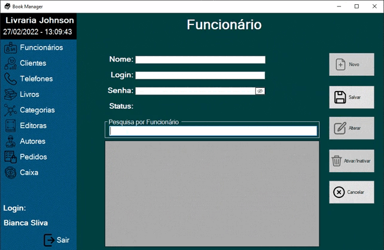

# 
Book Manager

Esse projeto é uma aplicação para gerenciamento de loja de livros.

Projeto desktop em desenvolvimento utilizando o DotNet junto ao SQLServer.

 

Tela de Acesso a aplicação:

 

Painel de Funcionários (Cadastros):
 

 

Painel de Funcionários (Pesquisa):
 

 

Painel de Clientes (Formulário):
 

 

## Recursos 

- [x] Banco de dados para Clientes e Funcionários.
- [x] Tela de Login para Funcionários.
- [X] Função de ocultar senha.
- [x] Proibição de acesso para Funcionários desabilitados.
- [x] Função de verificação de login e senha.
- [x] Tela de Funcionários.
- [x] Formulário de dados para funcionário. 
- [x] Cadastro de Funcionário.
- [x] Pesquisa de Funcionário.
- [x] Desabilitar Funcionário.
- [x] Habilitar Funcionário.
- [x] Alteração de dados de Funcionário.
- [x] Tela de Cliente.  
- [x] Formulário de dados para Cliente.  

## Tecnologias

- [x] C#
- [x] Dotnet
- [x] SQLServer 

## Autor 

 

David Lucas

Linkedin:(https://www.linkedin.com/in/-david-lucas/)

